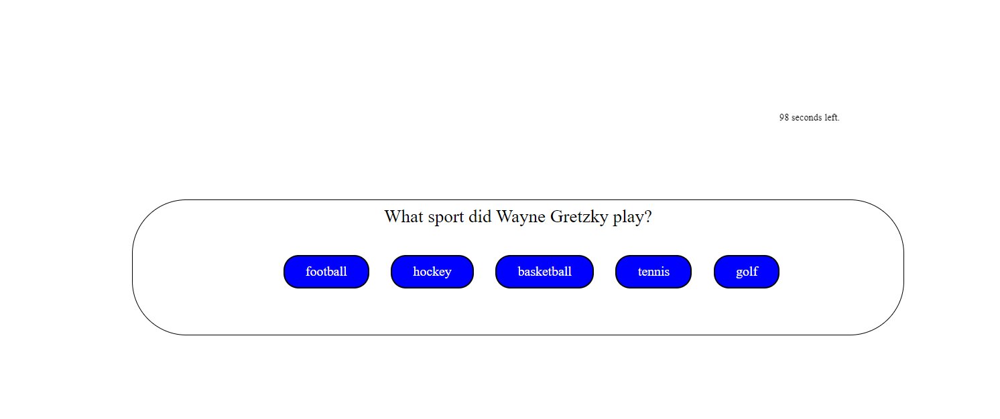

# pop_quiz_hotshot

## Description

This application is quiz that displays one of 5 questions to the user, asks them to answer each question, and then at the end will give the user a score that can be saved to the leaderboard list.

## Installation

There is not installation needed in order to utilize this application. Simply visit the website at the following link:
https://jonahkane.github.io/pop_quiz_hotshot/

## Usage

To use this application, the user will visit the page and be presented with rules for the quiz and a start button. Upon clicking the start button, the user will be presented with the first of 5 questions. Each question will be mulitple choice with 4 options. When they click one of the options, the app will check to see if they answered correctly or not, and will tell the user as such. When they reach the end of the quiz, the app will display their final score and give them the option of submitting their results to the leader board page. when they submit their results, they will be taken to the leader board page to see how they compare to the other submitted scores.

## Credits

N/A
No additional collaborators used but skills learned from UofM Bootcamp course. However resources such as google, youtube, UofM tutoring, and bootcamp TA help and guidance were used.

## License

Please refer to the LICENSE in the repo if applicable.
